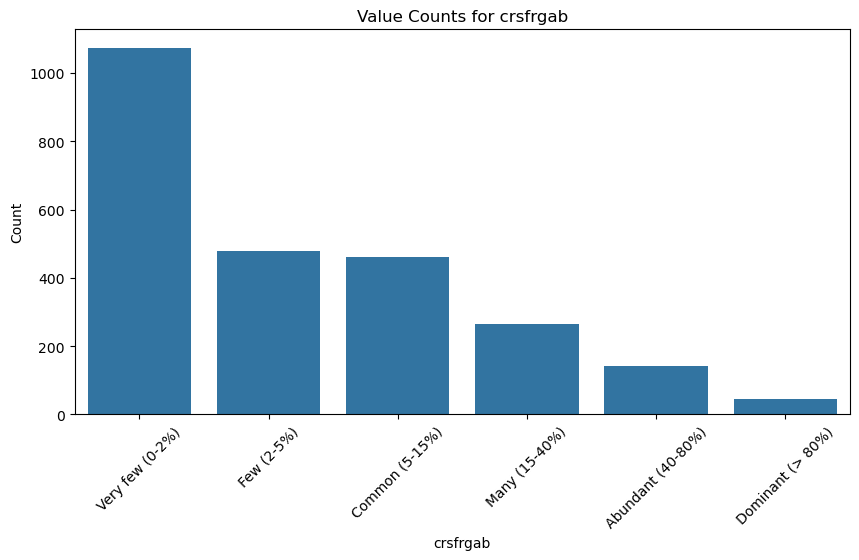
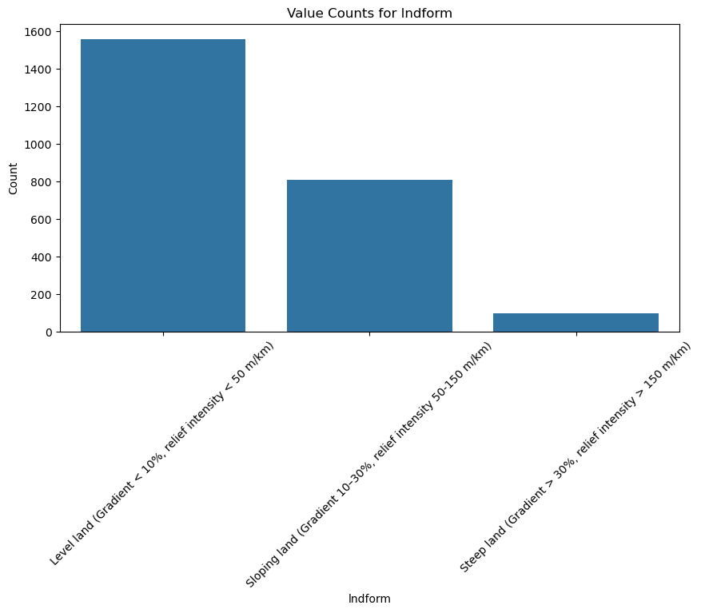
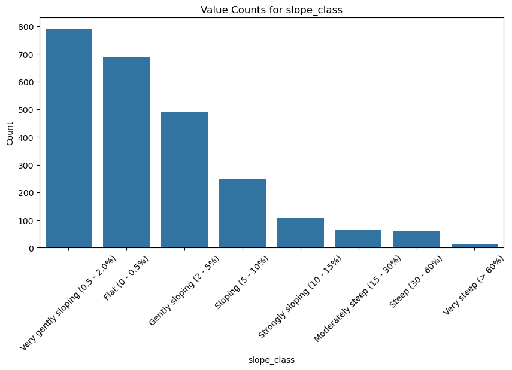

# 1.0 Project Overview

## 1.1 Problem Statement
Modern farmers face multiple challenges in determining optimal crop yields and selecting appropriate fertilizer types for their land. These challenges have become more pronounced today due to climate change, soil degradation, unpredictable weather patterns, rising input costs, and the growing need to balance agricultural productivity with environmental sustainability. 

In addition, there remains a notable gap in the availability and accessibility of modern tools and technologies that can support farmers in optimizing productivity and managing agricultural operations efficiently.

Despite these challenges, several emerging digital agricultural solutions have been developed. 

1. One such tool is Ujuzi Kilimo, a Kenya-based AI-driven farming platform that analyzes soil conditions based on chemical properties. It relies on a soil sensor device (SoilPal) that is inserted directly into the ground to measure soil nutrients, pH levels, and overall soil health. The platform then provides fertilizer recommendations and suggests suitable seed varieties based on the analyzed soil data. Farmers can access these services through SMS, USSD, or field agents, making it accessible even in low-connectivity areas.

2. Another example is CropSense, a data-driven decision-support system that integrates satellite imagery, IoT sensor data, weather information, and machine learning models to enhance crop yield, reduce production costs, and improve sustainability. In soil analysis, CropSense focuses on key indicators such as nutrient levels, soil carbon content, and soil moisture to generate recommendations for soil improvement and better land management practices.

## 1.2 Gap and Invested Stakeholder
Despite these advancements, the existing tools lack a user-friendly interface that can be easily adopted by farmers, particularly those in rural or resource-constrained settings. Additionally, many of the current algorithms rely heavily on chemical soil properties, which require farmers to use specialized and often expensive equipment to obtain accurate measurements.

As a result, there is a notable gap in AI-driven agricultural tools that utilize basic physical soil characteristics, which are easier for farmers to observe and collect without advanced instrumentation or education.

Addressing this gap, the proposed project leverages both physical and photographic soil attributes to design an intelligent algorithm and accompanying mobile application. The system will be hosted on a platform that allows farmers to interact with it in two primary ways:

1. Entering observable physical soil attributes.
2. Uploading images of their soil for visual analysis.

This approach aims to support farmers, particularly emerging farmers, in making informed agricultural decisions by enabling the system to:

* Recommend suitable crops for optimal yield based on physical soil attributes.
* Suggest appropriate fertilizers to improve soil productivity and overall output.

## 1.3 Models Similar to Our proposed Study
Our model will closely mirror that of PlantVillage Nuru, a mobile application that uses computer vision and deep learning to analyze crop leaves through a smartphone camera and detect diseases, pests, or damage in real time.  

Similarly, our project adopts a computer vision–based approach, but extends the concept from crop health diagnosis to soil analysis, enabling farmers to obtain actionable insights using only a smartphone.

The project will also benefit:
* Ministry of agriculture for fertilizer imports and location deployment.
* Agricultural Food Authority  for yield predictions based on location.

# 2.0 Business Understanding

## 2.1 Business Problem
Existing AI-driven farming tools predominantly rely on chemical soil attributes to provide recommendations regarding suitable crops and fertilizer options. However, relatively few models leverage physical soil characteristics, despite their accessibility and ease of observation for many farmers. 

Additionally, there is a limited number of agricultural AI tools that offer intuitive and user-friendly interfaces tailored to the needs of farmers, particularly those with minimal technical expertise. Furthermore, to the best of our knowledge, very few existing systems allow farmers to upload images of their soil for automated analysis and insight generation.

To address these challenges, this project focuses on predicting soil types using a combination of image-based and observable physical attributes. Specifically, the model will utilize:

* Photographic images of soil samples.

* Physical soil characteristics including: erosion type, surface crust, surface salt presence, surface stones, landform, slope class, slope position, bare soil conditions and grazing signs.

This multimodal approach is intended to enhance accessibility and enable farmers to obtain reliable crop suggestions and agricultural recommendations using readily available information.

## 2.2 Business Questions

The project seeks to answer the following business questions:

### Primary Question:

How effectively can crop type be predicted by combining soil images with field-observed physical soil attributes?

* How accurately can crop type be predicted using field-observed physical soil indicators (erosion signs, slope characteristics, surface stones, and crust formation)?

* How accurately can crop type be predicted using soil images?

### Secondary Questions:

1. Which physical soil attributes (slope class, landform, erosion type, grazing signs) are the strongest predictors of crop type?

2. Which land management practices (irrigation mode, manure application, ploughing direction, tillage mode, ploughing sign) have the greatest influence on crop type selection?

3. How do grazing intensity indicators (overgrazing signs, bare soil exposure, dung presence) affect the suitability and prediction of crop types?

4. How does geographical location (latitude, longitude and altitude) influence the crop type grown?

## 2.3 Business Objectives

The main objective of this project is to develop a dashboard and mobile application that enables farmers to both upload images of their soil and input observable physical attributes in order to obtain reliable crop suggestions and data-driven agricultural recommendations using readily available field information.

# 3.0 Data Understanding

## 3.1 Data Description and Sources
This project will utilize 2 datasets that contain information on:

1. The geographic, physical soil attributes, land management practices and grazing intensity indicators.

2. Several images of different types of soil.

* Both datasets will be sourced from Soil4Africa website: https://africasis.isric.org/.

* The dataset on the 1st variables is located at: https://africasis.isric.org/ows/s4a_data?SERVICE=WFS&REQUEST=GetFeature&VERSION=2.0.0&TYPENAMES=ms:plot_field_data_download&outputFormat=text/csv&Propertyname=msGeometry,plot_code,country_code,country_name,survey_date,altitude,longitude,latitude,tsu_id,plot_id,obstruct_lyr,depth_restriction_cause,sign_of_erosion,rill_erosion,gully_erosion,mass_erosion,stone_pedestals,stone_pavement,wind_erosion,srf_salt,srf_crust,CrsFrgAb,srf_stone,Lndform,slope_class,slope_position,slope_pathway,tree_rating_15m_above,tree_rating_3m_15m,shrub_rating,herbaceous_rating,bare_soil,main_land_use,life_forms,crop_type,field_size,field_distribution_pattern,ploughing_sign,ploughing_direction,tillage_mode,input_crop_residue,input_green_manure,input_animal_manure,input_inorganic,water_supply,irrigation_mode,irrigation_water_source,grazing_sign_present,grazing_sign_infrastructure,grazing_sign_droppings,grazing_sign_grass,overgrazing_sign_bare,overgrazing_sign_dung,overgrazing_sign_deforest. 

* The dataset on the images is located at: https://dashboards.isric.org/explore/?form_data_key=fNmSEonazan2E4MnCgHz5GzczrnLcKcQlL9TIypbsSFULw28VG6WViVNTR8xOhLm&dashboard_page_id=DRumgsWPf&slice_id=290&permalink_key=AWEgppXGgzd.

Our goal is to merge both datasets using a common 'PLOT CODE' that is shared between them. 

## 3.2 Target Variable
* Our target variable will be 'crop type' which is a multi-class problem with over 11 different crops.

## 3.3 Feature Variables
* Our feature variables will include the remaining geographic, physical soil attributes, land management practices and grazing intensity indicators. These add up to a total of 54 features:

## 3.3 Feature Variables

* Our feature variables will include the remaining geographic, physical soil attributes, land management practices and grazing intensity indicators. These add up to a total of 54 features:

### Identifiers and geographical attributes
* X — Longitude (X coordinate)
* Y — Latitude (Y coordinate)
* plot_code — Plot Code
* country_code — Country Code
* survey_date — Survey Date
* altitude — Altitude
* longitude — Longitude
* latitude — Latitude
* tsu_id — Technical Sampling Unit Identifier
* plot_id — Plot Identifier
* country_name — Country Name
 
### Physical soil attributes
* obstruct_lyr — Obstructive Layer Presence
* depth_restriction_cause — Depth Restriction Cause
* sign_of_erosion — Signs of Erosion
* rill_erosion — Rill Erosion Presence
* gully_erosion — Gully Erosion Presence
* mass_erosion — Mass Erosion Presence
* stone_pedestals — Stone Pedestals Presence
* stone_pavement — Stone Pavement Presence
* wind_erosion — Wind Erosion Presence
* srf_salt — Surface Salinity
* srf_crust — Surface Crusting
* crsfrgab — Coarse Fragments Abundance
* srf_stone — Surface Stone Cover
* lndform — Landform Type
* slope_class — Slope Class
* slope_position — Slope Position
* slope_pathway — Slope Pathway
* tree_rating_15m_above — Tree Cover Rating (Above 15m)
* tree_rating_3m_15m — Tree Cover Rating (3m–15m)
* shrub_rating — Shrub Cover Rating
* herbaceous_rating — Herbaceous Cover Rating
* bare_soil — Bare Soil Percentage
* main_land_use — Main Land Use
* life_forms — Dominant Life Forms
* field_size — Field Size
* field_distribution_pattern — Field Distribution Pattern

### Land management practices
* ploughing_sign — Evidence of Ploughing
* ploughing_direction — Ploughing Direction
* tillage_mode — Tillage Mode
* input_crop_residue — Crop Residue Input
* input_green_manure — Green Manure Input
* input_animal_manure — Animal Manure Input
* input_inorganic — Inorganic Input (Fertilizer Use)
* water_supply — Water Supply Availability
* irrigation_mode — Irrigation Mode
* irrigation_water_source — Irrigation Water Source

### Grazing intensity indicators
* grazing_sign_present — Presence of Grazing Signs
* grazing_sign_infrastructure — Grazing Infrastructure Presence
* grazing_sign_droppings — Presence of Animal Droppings
* grazing_sign_grass — Grazing Impact on Grass
* overgrazing_sign_bare — Overgrazing Indicator (Bare Soil)
* overgrazing_sign_dung — Overgrazing Indicator (Dung Concentration)
* overgrazing_sign_deforest — Overgrazing Indicator (Deforestation Signs)

# 4.0 Data Preparation and Cleaning
## 4.1 Data Preparation
We used several libraries to prepare and analyze the dataset:

1. Pandas - to read our csv files and perform exploratory data analysis.
2. Matplotlib - for visualizations.
3. Base64 and BytesIO - to decode images from Base64 format and convert to Bytes format.
4. Numpy - for conversion of data into numpy arrays for modelling.
5. Scikit-learn - for model fitting and evaluation.
6. Tensorflow - for neural network algorithms.
7. Joblib and Os - for deployment.

## 4.2 Data Cleaning
Prior to data analysis, we loaded 2 different datasets:

### Physical Soils Dataset
 This dataset had 13876 entries and 55 columns. It contained the identifiers and geographic attributes, grazing intensity indicators, land management practises and physical soil characteristics of soil. They have all been listed in the aforementioned section 3.3.
 * This dataset also contained our target variable 'crop type'.
 * The following cleaning methods were done to the dataset:

 1. Our target variable had 5,800 missing values. We therefore dropped all columns that had more than 5,800 missing values since attempting to fill them would mean that we fill 41.7% of missing values. This would affect the integrity of our data and the accuracy of our model. 
 * The result was 13876 entries with 39 columns.

 2. We dropped the X and Y columns since these represented longitude and latitude which were already present. 
 * The result was 13876 entries with 37 columns.

 3. We dropped all remaining missing rows.
 * The result was 2467 entries with 37 columns.

 4. There were no duplicated values.

 ### Soil Image Dataset
 To download the images from the website, we developed a scraping function that:

- **Set configuration and paths**  
  Defines a download directory, ensures it exists, and sets the total number of pages to scrape (21).

- **Initialize Selenium WebDriver**  
  Configures Chrome options (auto-download without prompts), launches the browser, and prepares waiting and interaction utilities.

- **Open target dashboard**  
  Navigates to the ISRIC Superset dashboard URL and scrolls to the bottom to trigger full table loading.

- **Wait for initial data load**  
  Pauses execution to allow dynamic content (especially the bottom table) to render.

- **Apply “Kenya” filter**  
  Expands the *Country name* filter panel, types “Kenya,” selects it from the dropdown, and applies the filter.

- **Wait for filtered data reload**  
  Allows time for the dashboard to refresh and display only Kenya-related data.

- **Adjust table to show 20 entries per page**  
  Locates the table length dropdown and changes it to display 20 rows, then waits for reload.

- **Iterate through all pages (main scraping loop)**  
  For each page (1 → 21), performs the following:
  - Opens the bottom table’s menu (three-dot menu).
  - Hovers over the “Download” option.
  - Clicks “Export to CSV” to download data as a ZIP file.

- **Handle file downloads and renaming**  
  Waits for downloads to finish, then renames each ZIP file sequentially (e.g., `K1.zip`, `K2.zip`, …).

- **Paginate to the next page**  
  Scrolls to the pagination controls, clicks the next page number, verifies the page activated (via UI highlight), and waits for new data to load.

- **Error handling and cleanup**  
  Catches critical errors, saves a screenshot if pagination fails, and ensures the browser is closed at the end.

Note: The python file containing the scraping function is stored in the data folder.

* We were able to successfully scrape 21 folders, each with 20 images of Kenyan Soil. 
* These were uploaded to a Google Drive: https://drive.google.com/drive/u/0/folders/1honHwyjgb__J80g5asjNfgTUTje_N--E
* Prior to concatenating our 21 datasets, we used 1 dataset as a trial to view our images.
* The images were downloaded correctly but having been encoded in a string that is a data URL (Data URI) containing an image encoded in Base64.

Working with the above format would have been associated with the following:
* Large file size overhead → Base64 encoding would have increased size by ~33%, making storage and transfer less efficient compared to normal image files.
* Memory usage → Entire image must be loaded into memory as a string before decoding, which can be heavy for large datasets or many images.
* Slower processing → Requires encoding/decoding steps, adding CPU overhead when reading or writing images.
* Harder to manage → Images are embedded in text, so you can’t easily preview, edit, or organize them like normal .png/.jpg files.

Secondly, we noted by viewing the images that the vertical photos all have noise data including:
* Hand tools used by the farmers.
* Holes dug by the farmers.

These may lead to:
* Spurious feature learning (shortcut bias) - The network may latch onto tools or hole shapes instead of soil properties. This is a classic case of models exploiting Spurious Correlation, where non-causal cues become predictive simply because they co-occur with labels.
* Reduced generalization. If test images don’t contain tools/holes (or contain different ones), performance drops. The model hasn’t learned soil characteristics; it learned context artifacts.

We noted however that the horizontal_up photos have minimal noise and still capture both crop and soil characteristics. We therefore:
1. Concatenated the 21 datasets.
2. Dropped the horizontal_down (since most people take photos horizontally up and it is a repetition of the horizontal_up) as well as vertical photos (due to noise effect).
3. Converted the maintained 'horizontal_up' photos to arrays that would make it easy to analyze the dataset.
4. Stored the file as a new csv file - 'soil_photos'.

* There were no missing values.
* The result was 396 images with 2 columns.

### Combined dataset with both Images and Physical Soil Attributes
To have an algorithm that incorporates both physical soil attributes and soil images of Kenya, we incorporated our physical soil dataframe (which contains the dataframe with the cleaned physical soil attributes) and the combined images dataframe (which contains the Cleaned Kenyan Dataset with images as numpy arrays).

* We got an eventual dataset that contained only Kenyan Data. 
* This was used solely for the soil image classifier.
* Following the merge, we had 87 combined Kenyan physical soil attributes + soil images (in numpy arrays).

# 5.0 Exploratory Data Analysis
In this section, we did a general analysis of our data:

## Summary of General Findings
### Physical Soil Attributes
* In most instances there was no erosion (1800 vs 600).

* Most land did not contain any surface salt (2400 vs 50).

* There was no surface crust (2400 vs 100).

* Most land had either very few or few coarse fragments abundance [crsrfgab] (1159, 750).

* Most land had fine gravel and medium gravel (1150, 750).

* Most land was level land or sloping land (1550, 800). A small majority was steep land (100).

* Most land was either very gently sloping, flat, or gently sloping (790, 690, 500).

* Most land had no bare soil (1800 vs 600).

### Land Management Practices
* Most land was cultivated and managed land (2300). Very few were cultivated aquatic or semi-natural vegetation (200 vs 150).

* The most common life forms were herbaceous-graminoids and herbaceous-non-graminoids (1400 vs 500).

* The most common crop type was cereals (1500), roots and tubers (250), pulses (200), oil crops (180), and fruits (170).

* Most land was either 2 to 5 acres (900) or 1 to 2 acres (600).

* The common field distribution pattern was contiguous vs non-contiguous (1150 vs 1100).

* In terms of ploughing, most land had signs of tillage in the past while some had signs of fields recently tilled (1200 vs 980).

* Most farmers ploughed along contours (1050).

* Most lands were tilled manually using a hoe (1050) while some were tilled using animals (800). Only (400) were tilled using a mechanical tractor.

* Almost an equal amount of farmers used crop residue as fertilizer (1300 vs 1100).

* A majority did not put green manure (2200 vs 300).

* Similarly, a majority did not put animal manure (1800 vs 650).

* A majority did not put inorganic fertilizer (1550 vs 900).

* Most farmers relied on rainfall (2300) as compared to irrigation (200).

### Grazing Intensity Indicators
* Most land did not show signs of grazing (1600 vs 800).

* Neither did they have any grazing infrastructure (2100 vs 450).

* They also did not have grazing sign droppings (1750 vs 750).

* And did not have any grazing grass (1750 vs 750).

* Most land did not show signs of overgrazing (2100 vs 400).

* Most land did not show signs of overgrazing deforestation (2100 vs 400).

## Summary of strongest predictors of crop type per attribute category: soil, land management, grazing intensity indicators or geographical factors

We also which soil, land management, grazing intensity indicators or geographical factors influenced crop type the most:

1. Which soil attributes (slope class, landform, erosion type, grazing signs) are the strongest predictors of crop type?
    * Vegetation and land cover characteristics are the strongest predictors within soil attributes.
    * Key features included:
  - **Herbaceous (Non-Graminoids)** (0.792)
  - **Tree-based systems** (0.725)
  - **Vines** (0.709)
  - **Shrubs** (0.655)
  - **Cultivated aquatic or regularly flooded areas** (0.499)

2. Which land management practices (irrigation mode, manure application, ploughing direction, tillage mode, ploughing sign) have the greatest influence on crop type selection?
    * Farming practices significantly influenced crop type selection.  
    * The most important practices were:
  - **Manual tillage (hoe)** (0.679)
  - **Rainfed water supply** (0.522)
  - **Mechanical tillage (tractor)** (0.451)
  - **Signs of recently tilled fields (ridges/heaps)** (0.357)
  - **Use of animal manure** (0.335)

3. How do grazing intensity indicators (overgrazing signs, bare soil exposure, dung presence) affect the suitability and prediction of crop types?
    * Grazing activity indicators contributed to crop type prediction.  
    * Key indicators included:
  - **Grass grazing present** (0.542)
  - **Grazing infrastructure present** (0.535)
  - **General grazing presence** (0.356)
  - **Animal droppings present** (0.319)
  - **Dung-related overgrazing signs** (0.154)

4. How does geographical location (latitude, longitude and altitude) influence the crop type grown?
    * Country location played a strong role in predicting crop type.
    * The most influential countries were:
  - **Ghana** (0.524)
  - **Tunisia** (0.491)
  - **Benin** (0.436)
  - **Morocco** (0.410)
  - **Angola** (0.397)

## Summary of which physical conditions favored particular crop types
From our dataset, we observed which physical conditions favored particular crop types:

1. Cereals
* Soil Composition: Thrives in fine gravel (49%) with very few coarse fragments (47%).
* Topography: Found predominantly on level land (64%) that is either flat (31%) or very gently sloping (32%).
* Vegetation & Layout: Strongly associated with herbaceous graminoids (73%). Typically grown in 2 to 5 acre fields (37%) using contiguous patterns (both regular and irregular).

2. Fibre Crops
* Soil Composition: Prefers fine gravel (40%) and medium gravel (39%) with very few coarse fragments.
* Topography: Overwhelmingly grown on level land (77%) that is very gently sloping (41%).
* Vegetation & Layout: Associated largely with trees (31%) and herbaceous plants. Grown in 2 to 5 acre fields (36%) with highly regular, contiguous patterns (63%).

3. Fodder Plants
* Soil Composition: Best suited for fine gravel (41%) with very few coarse fragments (53%).
* Topography: Dominates on level land (82%) with flat terrain (53%).
* Vegetation & Layout: Notably, this crop has the highest association with cultivated aquatic/flooded areas (38%). Associated with herbaceous graminoids (65%) and grown in slightly larger fields ranging from 2 to 12 acres.

4. Fruits
* Soil Composition: Grown in fine gravel (39%) or medium gravel (35%) with very few coarse fragments.
* Topography: Prefers level land (74%) with flat terrain (39%).
* Vegetation & Layout: Heavily associated with trees (54%). Typically grown in 2 to 5 acre fields (33%) following regular, contiguous patterns (56%).

5. Nursery Stock 
* Soil Composition: Uniquely prefers coarse gravel (50%) with very few coarse fragments.
* Topography: Uniquely prefers sloping land (75%) across a mix of flat, moderately steep, sloping, and strongly sloping classes.
* Vegetation & Layout: Grown in very small fields of less than 1 acre (75%) with scattered field distribution patterns (50%). Half of these fields feature bare soil.

6. Oilcrops
* Soil Composition: Prefers fine gravel (42%) and medium gravel (40%).
* Topography: Found on level land (64%) that is very gently sloping (40%).
* Vegetation & Layout: Mostly associated with herbaceous non-graminoids (44%) and trees (34%). Typically found in 2 to 5 acre fields (34%) with regular, contiguous patterns.

7. Other Crops (e.g., rubber)
* Soil Composition: Grown in fine gravel (52%) with very few coarse fragments (57%).
* Topography: Prefers level land (64%) with flat terrain (34%).
* Vegetation & Layout: Associated with trees (36%) and graminoids (32%). Predominantly grown in 2 to 5 acre fields (50%) with irregular contiguous patterns.

8. Pulses
* Soil Composition: Prefers fine gravel (39%) and medium gravel (35%).
* Topography: Grown on level land (61%) that is very gently sloping (38%).
* Vegetation & Layout: Strongly associated with herbaceous non-graminoids (53%). Typically found in 2 to 5 acre fields (35%) with regular contiguous patterns.

9. Roots and Tubers
* Soil Composition: Found in fine gravel (50%) with varying levels of coarse fragments (Common to Very Few).
* Topography: Shows a higher tolerance for slopes; while 53% is on level land, 39% is on sloping land. Terrain is mostly very gently sloping (27%) or gently sloping (24%).
* Vegetation & Layout: Associated with herbaceous non-graminoids (51%). Grown in 2 to 5 acre fields, but uniquely features highly irregular contiguous field patterns (57%).

10. Semi-Luxury Foods (coffee, tea, cocoa, tobacco, nuts)
* Soil Composition: Prefers medium gravel (33%) and fine gravel (30%).
* Topography: Found across a mix of level land (50%) and sloping land (41%).
* Vegetation & Layout: Associated with trees (34%) and shrubs (28%). Typically grown in slightly smaller fields of 1 to 2 acres (30%) with regular contiguous patterns.

11. Vegetables
* Soil Composition: Grown in fine gravel (35%) or medium gravel (31%) with very few coarse fragments.
* Topography: Strongly prefers level land (85%) with flat terrain (46%).
* Vegetation & Layout: Associated with herbaceous non-graminoids (50%). Field sizes are highly diverse (evenly split between <1 acre, 2-5 acres, and 5-12 acres), typically utilizing regular contiguous patterns.

## Summary of which fertilizers supported particular crop types 
We finally also observed which fertilizers supported crop types the best:

1. Cereals
- Crop residue: 47.22% Yes, 52.78% No  
- Green manure: 10.35% Yes (very low adoption)  
- Animal manure: 28.55% Yes  
- Inorganic fertilizer: 40.93% Yes  

2. Fibre crops
- Crop residue: 48.57% Yes (balanced usage)  
- Green manure: 12.86% Yes (low)  
- Animal manure: 15.71% Yes  
- Inorganic fertilizer: 50.00% Yes (highest among inputs)  

3. Fodder plants
- Crop residue: 35.29% Yes  
- Green manure: 8.82% Yes (very low)  
- Animal manure: 23.53% Yes  
- Inorganic fertilizer: 35.29% Yes  

4. Fruits
- Crop residue: 38.46% Yes  
- Green manure: 20.19% Yes (relatively higher than most crops)  
- Animal manure: 34.62% Yes  
- Inorganic fertilizer: 29.81% Yes  

5. Nursery stock
- No fertilizer usage recorded across all types (100% No)

6. Oilcrops
- Crop residue: 54.62% Yes (most used input)  
- Green manure: 8.40% Yes  
- Animal manure: 10.92% Yes  
- Inorganic fertilizer: 33.61% Yes  

7. Other crops (e.g., rubber)
- Crop residue: 15.91% Yes  
- Green manure: 2.27% Yes (extremely low)  
- Animal manure: 6.82% Yes  
- Inorganic fertilizer: 18.18% Yes  

8. Pulses
- Crop residue: 42.29% Yes  
- Green manure: 8.57% Yes  
- Animal manure: 26.86% Yes  
- Inorganic fertilizer: 29.71% Yes  

9. Roots and tubers
- Crop residue: 51.13% Yes (slightly dominant)  
- Green manure: 12.78% Yes  
- Animal manure: 24.06% Yes  
- Inorganic fertilizer: 21.05% Yes  

10. Semi-luxury crops (coffee, tea, cocoa, tobacco, nuts)
- Crop residue: 41.84% Yes  
- Green manure: 7.14% Yes  
- Animal manure: 21.43% Yes  
- Inorganic fertilizer: 45.92% Yes (most used input)  

11. Vegetables
- Crop residue: 46.15% Yes  
- Green manure: 7.69% Yes  
- Animal manure: 46.15% Yes (high usage)  
- Inorganic fertilizer: 46.15% Yes (equally high usage)

Summarized visual: 

Tableau: Dashboard on the Physical Soil Attributes influencing crop type: https://public.tableau.com/app/profile/thomas.amuti/viz/Dashboardonthephysicalsoilattributesinfluencingcroptypes_/Dashboard1?publish=yes

# 6.0 Modelling
We developed 2 models:
* For predicting crop type given physical soil attributes.
* For predicting crop type given soil images.

For the former, we used the following models:
* Base Decision Tree: Training Accuracy 94.5%, Testing Accuracy 58.3%.
* Base Random Forest Classifier: Training Accuracy 94.7%, Testing Accuracy 64.0%.
* Hyperparameter tuned Decision Tree: Training Accuracy 66.5%, Testing Accuracy 64.6%.
* Hyperparameter tuned Random Forest Classifier: Training Accuracy 77.6%, Testing Accuracy 65.4%.
* Dense Neural Network: Training Accuracy 21.9%, Testing Accuracy 14.5%.

A comparison of the aforementioned algorithms is as shown:

For the latter, we used the Convolutional Neural Network which had a testing accuracy of 91% and validation accuracy of 81%. 

# 7.0 Recommendations
Almost all crops in this dataset require the exact same physical soil attributes: Cultivated land with no erosion, no surface salt, no surface crust, and no bare soil:

* Cereals, Vegetables, and Other Crops (Rubber) are "Flatland" crops. They prefer strictly flat, level land with fine gravel and very few coarse fragments.
* Fodder Plants also prefer flat land, fine gravel but uniquely stand out for having the highest association with aquatic or regularly flooded areas.
* Fruits, Fibre Crops, Oilcrops, and Pulses are "Gentle Slopes" crops. They prefer very gently sloping level land and thrive in a mix of fine to medium gravel. Fruits and fibre crops are heavily associated with tree cover.
* Roots and Tubers are "Irregular" crops. They have a higher tolerance for sloping land and are uniquely characterized by being planted in highly irregular field patterns.
* Semi-Luxury Foods, Coffee, Tea, Cocoa, Nuts are "Shrub/Tree" crops. They prefer slightly steeper sloping land, lean toward medium gravel, and are grown in smaller (1 to 2 acre) plots dominated by trees and shrubs.
* Nursery Stock are the Outlier crops. They thrive on sloping land with coarse gravel, utilizes tiny, scattered plots (less than 1 acre), and frequently tolerate bare soil.

Despite these suggestions, recall that crop growth is dependent on more than 1 physical attribute. We therefore advise for the use of the aforementioned developed models to predict crop type.

Concerning fertilizer options, given what farmers are using, consider the following recommendations based on observed usage:

- **Cereals:** Use **crop residue or inorganic fertilizer**, as both are commonly applied with crop residue slightly leading.  
- **Fibre crops:** Use **inorganic fertilizer**, which is the most widely used option for these crops.  
- **Fodder plants:** Use **crop residue or inorganic fertilizer**, as they are equally the most common choices.  
- **Fruits:** Use **crop residue**, with moderate support from animal manure as a secondary option.  
- **Nursery stock:** No clear fertilizer recommendation, as none are currently used in the data.  
- **Oilcrops:** Use **crop residue**, which is the most preferred fertilizer by a clear margin.  
- **Other crops (e.g., rubber):** Use **inorganic fertilizer**, though overall fertilizer use is generally low. 
- **Pulses:** Use **crop residue**, with inorganic fertilizer as a secondary option.  
- **Roots and tubers:** Use **crop residue**, which is the most commonly applied input.  
- **Semi-luxury crops (coffee, tea, cocoa, etc.):** Use **inorganic fertilizer**, the most dominant choice.  

- **Vegetables:** Use a **combination of crop residue, animal manure, and inorganic fertilizer**, as all are equally important.

# 8.0 Limitations
These are the limitations we encountered:

1. Limited labeled image dataset during modelling of our images to determine crop type. We had only 87 usable Kenyan soil images after cleaning which was a low sample. Fortunately, this small dataset did not reduce the generalisation ability of CNN model which performed well.

2. There was also class imbalance in crop types with some crops appearing very frequently while others appearing not as frequently. To tackle this, we applied class imbalance in our modelling. The aforementioned, however, did not aid in improving our dense neural network model.

3. In our dataset, vertical images contained noise with irrelevant objects. Some of these included tools, holes, hands. This limited their use in the image classification and thus we only focused on 'Horizontal up' photos.

4. The suggestions on fertilizer options to consider was based on observed usage from the dataset. This might not reflect optimal fertilizer options since the dataset did not contain factors such as yield or crop health.

# 9.0 Suggestions for Further Studies
We advise on:

1. Expanding the dataset by collecting a larger and more diverse set of soil images across multiple African countries, different climatic zones, seasons, and farming conditions to improve model generalisation, reduce bias, and enhance real-world performance.

2. Developing multimodal fusion models that combine soil images, physical soil attributes, and weather and climate data, crop health and yield to improve prediction accuracy and produce more robust and context-aware recommendations.

# 10.0 Deployment of our models

We developed a user-friendly dashboard for farmers with the following features:

1. Farmers can easily input physical soil attributes and receive crop recommendations.
2. Farmers can also upload images of their soil to receive crop recommendations.
* In both cases, the system additionally suggests the most suitable fertilizers based on the recommended crops.
* The dashboard supports offline use, allowing farmers to input data without an internet connection and receive recommendations once they are back online.

From the dashboard, we as developers also benefit by:
1. Monitoring the number of recommendations generated.

Our dashboard is hosted on the link shown: https://growright-frontend.onrender.com/ 